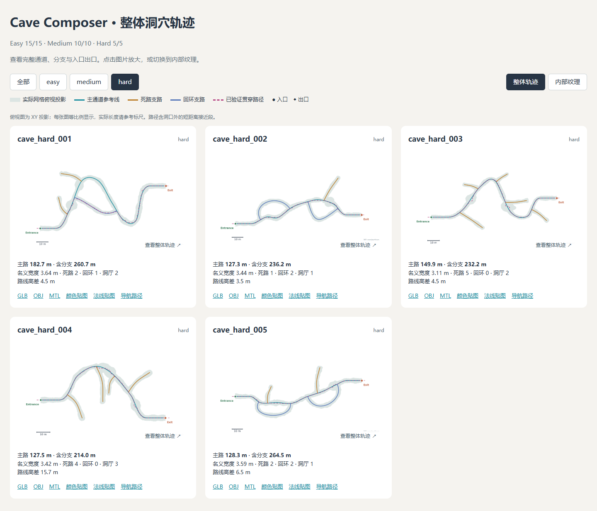

# Automated Cave Composer

Controllable procedural cave worlds for robot navigation research. Explicit turns,
branches, chambers and slopes become geological voids, independently validated
visual/collision meshes, navigation ground truth and geometric visibility metadata.

[](docs/figures/showcase/cave_showcase.png)

**Double-loop showcase:** [full-resolution images](docs/figures/showcase/README.md)
· [paper PDF](docs/figures/showcase/cave_showcase.pdf)
· [reproduction guide](docs/cave_showcase_v01.md).
Actual Blender renders of one generated cave with 100 floor stones and three
checkerboard props. The map is sampled from the mesh; it is not a sensor recording.

**Ready-to-view textured examples:** [easy / medium / hard gallery](exports/caves_difficulty_v01/index.html)
and [download guide](exports/caves_difficulty_v01/README.md). **30 scenes (15 easy,
10 medium, 5 hard)** are included
in this repository as **GLB with embedded 4K textures** and **OBJ + MTL + PNG**.
Each has real entrance/exit openings and a checked crossing path. Open the gallery
HTML locally after cloning; GitHub itself shows HTML source rather than running it.

**New structural diversity:** continuous cubic meanders, curved dead ends,
asymmetric single/double loops, chamber chains and varying elevation. The medium
and hard collection replaces the earlier repeated layouts; easy assets are
unchanged. See the [implementation and checks](docs/organic_cave_diversity_v02.md).
Difficulty labels describe geometry, not measured policy performance.

[](docs/figures/diversity/gallery_hard.png)

Click a route thumbnail in the local gallery for the full layout and, for new
medium/hard scenes, a main-passage elevation profile. On Windows,
`powershell -ExecutionPolicy Bypass -File scripts/open_gallery.ps1` opens the gallery
through a loopback HTTP server. The included asset collection occupies about 2 GB.

The optional [portal export](docs/portal_export.md) preserves the closed reference
and checks the open surface separately. [Paper figure prompt](docs/figures/cave_composer_pipeline_gpt_image2_prompt.md).

**V0.3:** variable route grammars (winding passages, branch networks, loops and
chamber sequences), held-out two-cycle topology, and independent occupancy A*
whose path is checked against both final meshes. See the
[v0.3 guide](docs/pipeline_v03.md) and [ICRA evidence plan](docs/icra_generator_evidence_plan.md).

[V0.3 results and gallery](PIPELINE_V03_REPORT.md): 27 complete scene bundles
(26 first-pass successes and one retained same-seed retry), paired protection
stress tests and 50 passing automated tests. A native query failure in the old
Rtree runtime was reproduced; the project `.venv` uses Rtree 1.4.1, with 12
successful metric replays and three complete scene reconstructions.

Retained from **v0.2:** deterministic headless generation, incremental batch manifests,
verified scene-level resume, same-seed retries with archived diagnostics, CAVERS
appearance presets and automatic quality galleries. Six distinct v0 examples
plus a loop example remain available as the initial geometry review.

[Automated pipeline guide (中文)](docs/pipeline.md)

[V0.2 results and review gallery](PIPELINE_V02_REPORT.md): 24/24 generated
geometries plus 2/2 CAVERS appearance variants passed the final smoke run;
38 automated tests passed. These results do not establish thousand-scene throughput.

## Start

**Navigation task extension:** [multi-task and stereo RGB workflow](docs/pipeline_v04_tasks.md)
adds independently checked branch goals, reusable occupancy planning, portable reset
contracts, calibrated stereo render checks and cave-level reference-data split audits.
The current audit covers 36 tasks on three existing caves; it is not a policy-training result.

Python 3.10+ (tested with 3.12.7), Blender for renders (tested with 5.2.1).

```bash
pip install -e ".[test]"
python generate.py --config configs/cave_b_sharp_turns.yaml --seed 42 --output outputs/my_cave
python generate.py --config configs/cave_e_chamber.yaml --seed 43 --output outputs/my_chamber --render --blender /path/to/blender --save-blend
python generate_dataset.py --distribution configs/train_distribution.yaml --num-scenes 100 --workers 4 --output outputs/train_100
python generate_dataset.py --distribution configs/train_distribution.yaml --num-scenes 100 --workers 4 --output outputs/train_100 --resume
python generate_dataset.py --distribution configs/topology_distribution.yaml --num-scenes 24 --workers 2 --output outputs/topology_24
```

On this workstation supply `--blender D:/Blender/blender.exe`. Elsewhere use PATH,
the `BLENDER_PATH` environment variable, or an explicit executable. No GUI is
needed: Python launches Blender with `--background`. Geometry generation itself
does not import Blender. Installed-package entry point: `cave-compose`.

```python
import cave_composer as composer
scene = composer.sample(split="train", difficulty="medium", seed=42,
                        output="outputs/api_sample")
scene = composer.generate("configs/cave_f_vertical.yaml", seed=17,
                          output="outputs/vertical_17")
```

Completed scenes are reused only after config/environment and full-file checksum
verification. `--resume` continues unfinished scenes or extends a batch when
`--num-scenes` increases; `--retry-failed` explicitly retries failed seeds while
archiving their previous artifacts. No seed is silently substituted.
Installed batch entry point: `cave-dataset`. Add `--render --save-blend` and a
Blender path for complete visual previews and editable packed scenes.

Every batch produces `manifest.json`, `quality.json`, `metrics.csv` and an
interactive local `index.html`. Per-scene `metadata/run.json` records stage
timings and errors. The optional `configs/cavers_distribution.yaml` applies
the observed CAVERS rock palette without requiring the source dataset at runtime.

## Inspect the delivered work

- [Pipeline usage and recovery contract](docs/pipeline.md)
- [V0.3 structural sampling and independent path verification](docs/pipeline_v03.md)
- [V0.3 results, native-runtime diagnosis and review gallery](PIPELINE_V03_REPORT.md)
- [ICRA hypotheses and required comparisons](docs/icra_generator_evidence_plan.md)
- [V0.2 pipeline report](PIPELINE_V02_REPORT.md)
- [V0 report (historical snapshot)](CAVE_COMPOSER_V0_REPORT.md)
- [Interactive local gallery](outputs/final/gallery.html)
- [Six-cave contact sheet](outputs/final/contact_sheet.jpg)
- [Independent architecture](docs/architecture_v0.md), [final decision](docs/architecture_final.md)
- [Specification and split contracts](docs/specification.md)
- [CAVERS material experiment](docs/cavers_material_experiment.md)
- [PLUME comparison](docs/plume_comparison.md)
- [Stonefish interface](docs/stonefish_interface.md)

Generated binaries live under ignored `outputs/`; run the configs to recreate
them after cloning. `docs/independent_checkpoint.json` and Git commit `7bf8111`
record the independent implementation before PLUME was accessed.

## Bundle

```text
visual/cave_visual.obj + .mtl + mesh.npz
collision/cave_collision.obj + mesh.npz
materials/rock_albedo.png + material.json
navigation/centerline.json + navigation_graph.json + junction_graph.json
navigation/spawn_points.json + goals.json + clearance.json + visibility_horizon.json
navigation/planned_path.json        # independent search and dual-mesh certificates
metadata/config.yaml + metrics.json + validation.json + provenance.json + checksums.json
previews/topology.png + overview.png + inside_01.png + inside_02.png
cave.blend                           # with --render --save-blend
stonefish/cave.scn + adapter.json     # optional adapter script
```

Source coordinates: metres, right-handed Z-up. Cave walls face into the void and
have sealed caps; the body is a free-space boundary for static concave collision,
not a convex solid enclosing the robot. Spawn/goal are inset. Nominal dimensions
are distinct from measured widths and certified spherical-robot clearance.

```bash
python scripts/export_stonefish.py outputs/my_cave --depth 20
blender --background --python scripts/audit_mesh_blender.py -- --scene outputs/my_cave
python scripts/validate_scene.py outputs/my_cave
python -m pytest -q
```

Verify the included textured examples without Blender or the original generation
workspace (the command does not modify the delivered files):

```bash
python scripts/verify_textured_exports.py --root exports/caves_difficulty_v01
```

Generate a closed reference first, then optionally open its terminal portals and
bake portable textured exports. Supply a new output directory for each step:

```bash
python scripts/export_portals.py --scene outputs/my_cave --output outputs/my_open_cave
blender --background --python-exit-code 1 --python cave_composer/blender_audit.py -- --scene outputs/my_open_cave
blender --background --python-exit-code 1 --python scripts/export_textured_cave.py -- --scene outputs/my_open_cave --output exports/my_cave --name cave
```

Portal export rejects terminal clipping planes that cross other routes. Geometry
integrity and certificates are checked before reuse. The included samples carry
a local reference mesh, config and navigation path for portable verification;
absolute paths in historical provenance are descriptive only.

## Registered cave showcase

The [double-loop showcase workflow](docs/cave_showcase_v01.md) reuses an existing
cave and adds explicit floor stones and checkerboard props, then checks the
portal path against both scene meshes. It produces a registered map with eight
actual Blender views, an offline interactive HTML page, a paper PDF/PNG and a
packed Blender scene. Generated files live in `outputs/cave_showcase_v01/`.

## Limits

Dense grids have a configurable allocation ceiling; limit workers by available
RAM. The field is not an exact SDF. Geological realism has visible route bias;
some safety-constrained necks become rounded. Grade changes and loop rejoin
connectors can be abrupt. No full recovered-topology isomorphism, exact-predicate
self-intersection proof, dynamic rock simulation, erosion physics, automatic LLM
parser, or measured PBR recovery is implemented. Blender shader bump is not
exported as a Stonefish normal map. Material statistics from a dataset prevent
calling that same dataset entirely untouched appearance OOD.

External CAVERS/Sketchfab assets are not bundled into the source repository.
The included examples use independently generated geometry and procedural
sandstone textures. This repository does not yet include an owner-selected license.
