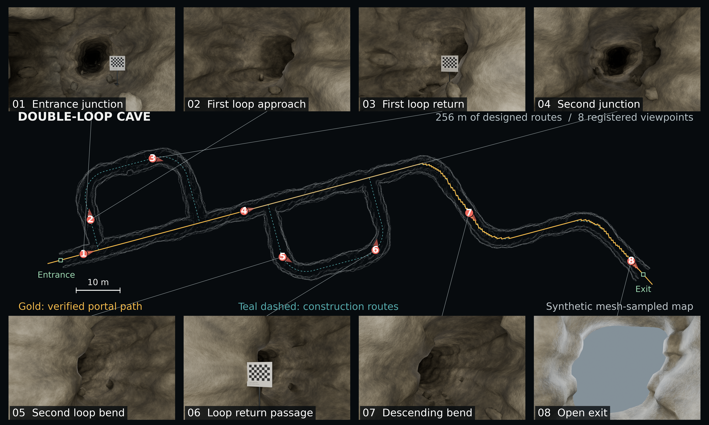
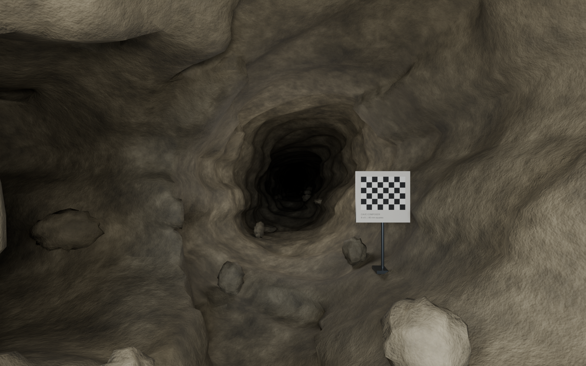
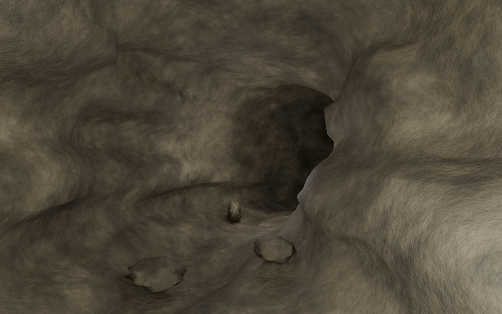
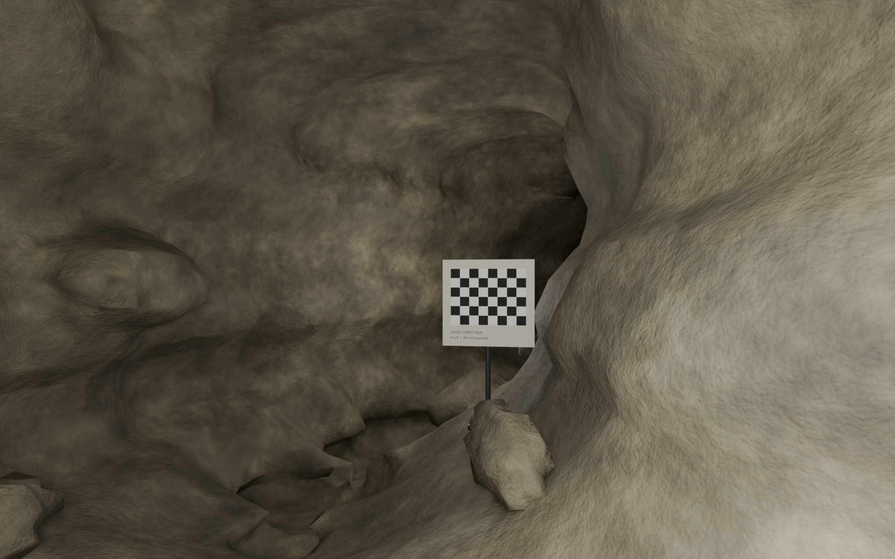
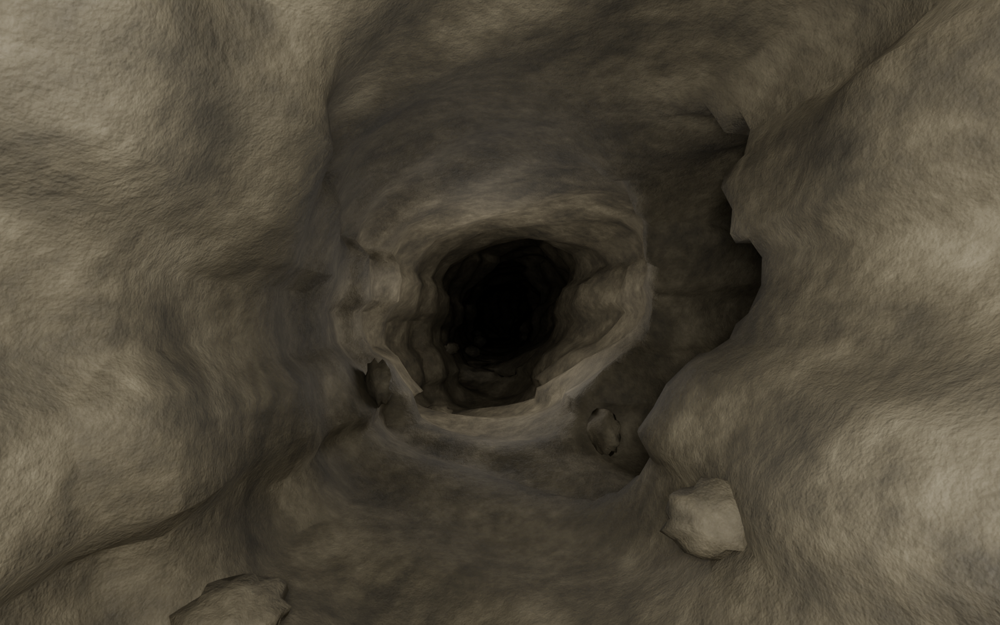
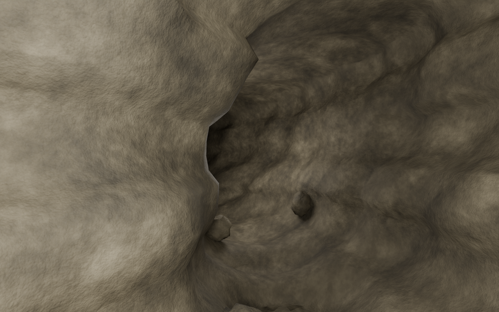
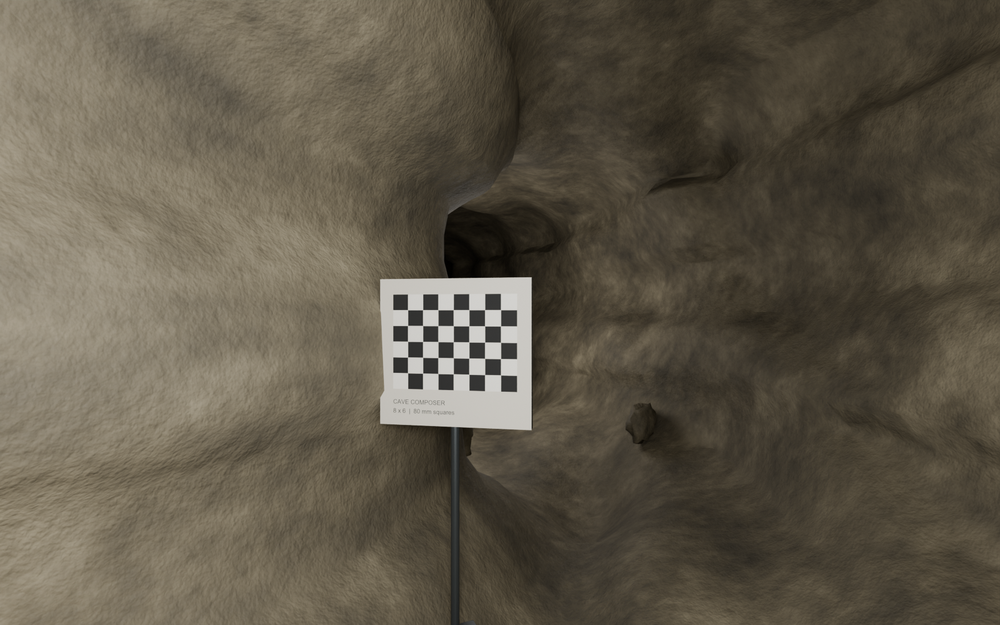
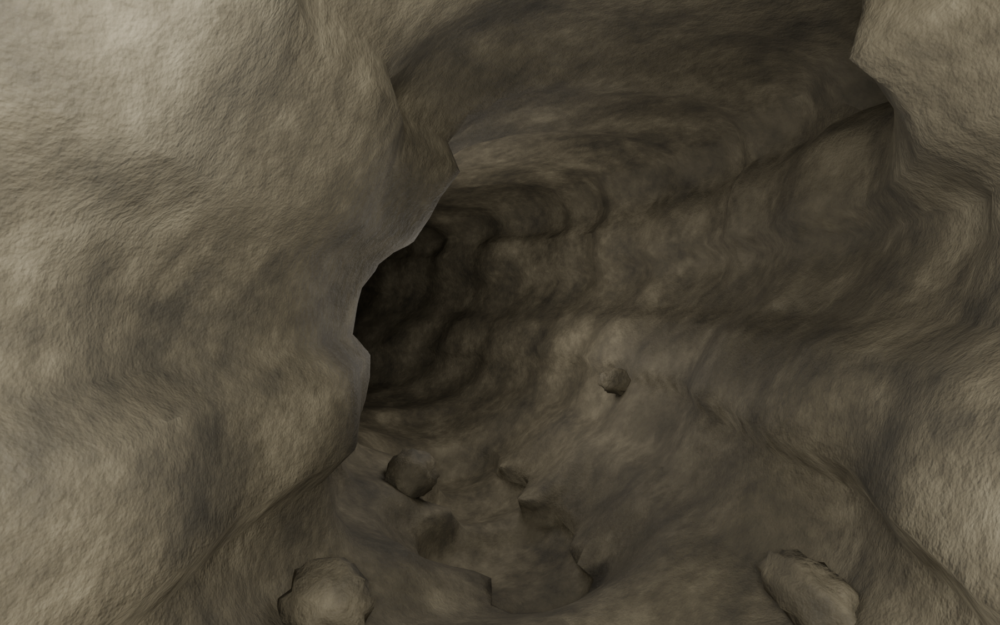
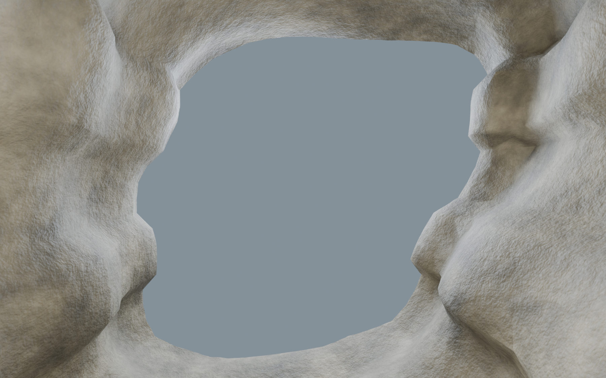

# Double-loop cave showcase

[6000 × 3600 PNG](cave_showcase.png) · [Paper PDF](cave_showcase.pdf) ·
[English caption](caption.txt) · [Reproduction and validation details](../../cave_showcase_v01.md)

Eight registered Cycles views of the same existing cave, with approximately
256 m of construction routes, two loops and two actual terminal openings.
The derivative includes 100 floor stones and three freestanding checkerboard props.
After asset insertion, the checked portal path has a continuous clearance lower
bound of 0.81 m on both scene meshes, above the required 0.55 m spherical radius.

The gray map is sampled generated geometry. Gold shows the checked portal path;
teal dashed lines show construction routes. These are qualitative scene renders
under inspection lighting, without water optics or robot execution experiments.

## Individual views

Each image is 1800 × 1125 pixels; click to inspect it at full resolution.

| Entrance junction | First loop approach |
| --- | --- |
|  |  |

| First loop return | Second junction |
| --- | --- |
|  |  |

| Second loop bend | Loop return passage |
| --- | --- |
|  |  |

| Descending bend | Open exit |
| --- | --- |
|  |  |

The interactive HTML and packed Blender scene are generated locally under
`outputs/cave_showcase_v01/`; the images and PDF above are included in Git.
