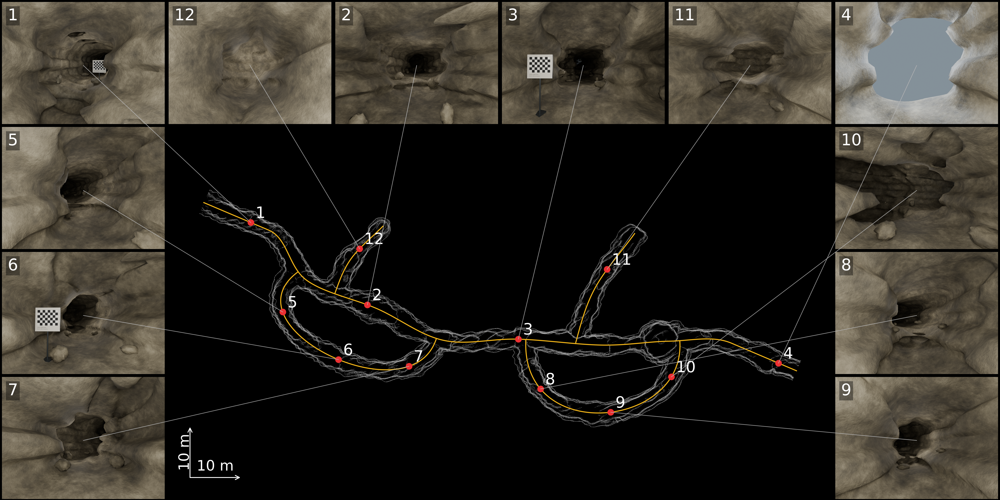

# Hard 005: registered cave showcase

- [7200 × 3600 PNG](figures/cave_showcase.png) / [paper PDF](figures/cave_showcase.pdf)
- [Offline interactive demo](index.html): clone and open locally; GitHub displays HTML source.
- Packed Blender scenes are local-only; use the reproduction instructions below.
- [English caption](figures/caption.txt) / [LaTeX inclusion](figures/latex_include.tex)
- [12 original 1600 × 1200 renders](views/) / [camera registration](views/registered_views.json)
- [Asset manifest](assets/manifest.json) / [geometric validation](validation.json) / [delivery checks](verification.json)

Reuses hard_005 (seed 1080501): two bypass loops, two blind branches, 264.5 m of
designed passages. Adds 100 floor stones and three checkerboard props. No cave
geometry is regenerated for this delivered showcase. All images are actual
Blender Cycles renders (128 samples), using source procedural materials and
inspection lighting. The gray map is sampled from the model; yellow lines are
construction centerlines. This is not a sensor reconstruction, an executed
robot trajectory, or a calibration experiment. There is no water medium.

After asset insertion the original portal path passes checks on both final
scene meshes, with a continuous clearance lower bound of 0.589 m for a required
radius of 0.55 m. These checks apply to that path, not arbitrary navigation tasks.

For a two-column paper use the PDF at full text width; individual views are also
provided for supplementary figures. Figure text and connectors remain vectors
in the PDF; rendered images and the mesh-sampled map are raster graphics.

The full preparation/verification bundle stays under
`outputs/cave_showcase_hard_v02/`. See [reproduction instructions](../../cave_showcase_hard_v02.md).
The stored validation/checksum files describe the original full delivery;
the source checkout keeps its figures and records, not its generated Blender file.
